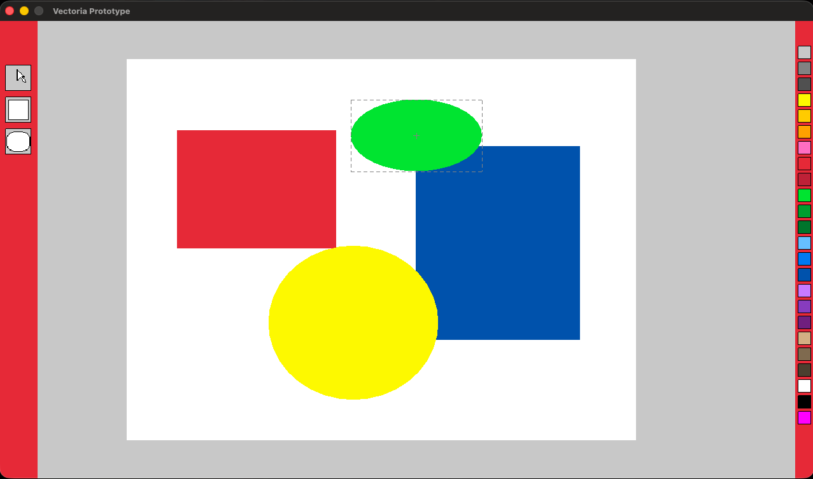

# Vectoria Prototype

Простой кроссплатформенный прототип векторного графического редактора на C++. Приложение позволяет создавать базовые геометрические фигуры на холсте и красить их.



## ✨ Возможости
* 🖱️ **Инструмент выделения:** выбор фигур и отображение рамки вокруг них (Select Box).
* 🔲 **Фигуры:** рисование прямоугольников и эллипсов.
* 🎨 **Палитра:** быстрое изменение цвета заливки выбранного объекта.
* 🎯 **Точный клик:** математически точный расчет попадания мыши в эллипс, а не просто по его квадратным границам.

## 🚀 Сборка на macOS
Для работы необходима установленная библиотека **Raylib** (`brew install raylib`).

Сборка проекта и запуск выполняются одной командой из корневой папки:
```bash
make run
```